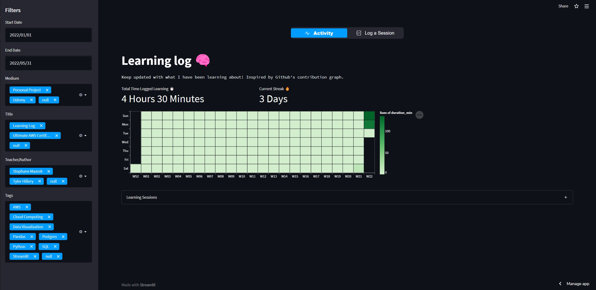

# **Learning Log 🧠**
A Sreamlit app that helps me keep track of learning. I wanted to be held accountable on my learning goals and what better way then make a public app where anyone can check to see how you're doing? This app would work great for challenges like the [#100DaysOfCode](https://www.100daysofcode.com/). Trying forking the repo and start tracking your progress!

## **Why create this?**
I always enjoyed GitHub's contribution graph and wanted something similar to track my learning. This project was also great experience with Streamlit a popular open source library that makes it easy to transform your python code into a web app. One of the best ways to learn something is to ***build*** something. 

**Note**: Below is how I originally created this app. I have since migrated my database to DuckDB as I didn't want to pay for an RDS instance anymore.

## **How did I create this?**
1. **Create Database**
    - I needed a place to store our data for our app. Since I am currently about AWS and cloud computing I thought this was be a great opportunity to try out RDS (relation database server). I was able to set up a PostgreSQL very quickly and used pgAdmin to connect to insert in some initial data. 
2. **Connect Database to Streamlit**
    - After creating the database and necessary tables I had to connect my streamlit_app.py so it can interact with the database. I had to create a secrets.toml file to store login credentials. Then with the psycopg2-binary package I was able to create the connection `psycopg2.connect(**st.secrets["postgres"])`. 
3. **Develope the app**
    - Now I need to start developing my app. I was basing the main graph off GitHub's contribution heatmap and wanted to recreate it with Streamlit. After trying on several different libraries and ended up using a vega-lite chart. After the main heat map was created I added some additional functionality:
        - Filtering (Date, tags, topic, medium)
        - Metrics (Total time logged, learning streak)
        - Expandable drop down to display DataFrame
        - Navigation bar to switch pages
        - A form to insert records into database with security credentials so only I can do it.
4. **Deploy app**
    - Using Streamlit Cloud (free version) I was able to create an account upload my app by connecting to my GitHub repo. I ran into a few issues with the requirements.txt at first. If you are developing the app on a windows machine and using `pip freeze > requirements.txt` to create the requirements.txt file. Make sure to remove the pywin32 and pywinpty packages. Also make sure to use psycopg2-binary vs psycop2. 

## Resources that I used to help create this app.
- #### **Inspiration**
    - [YouTube - How to Build a Dashboard Web App In Python with Sreamlit](https://www.youtube.com/watch?v=fThcHGiTOeQ&t=257s)
    - [YouTube - Build 12 Data Science Apps with Python and Streamlit](https://www.youtube.com/watch?v=JwSS70SZdyM&t=2601s)
    - [YouTube - How to Build a Streamlit App](https://www.youtube.com/watch?v=-IM3531b1XU&t=3s)
    - [YouTube - Make a Personal GitHub Progress Tracker](https://www.youtube.com/watch?v=DOIPzJQmjfE&t=192s)
- #### **Setting up Postgres**
    - [Blog - Setting up a PostgresSQL instance on the cloud, for free ⛅](https://towardsdatascience.com/setting-up-a-postgresql-instance-on-the-cloud-4ec4cf168239)
    - [Blog - A Practical Guide to Getting Set-up with PostgreSQL 🐘](https://towardsdatascience.com/a-practical-guide-to-getting-set-up-with-postgresql-a1bf37a0cfd7)
    - [Docs - Connect Data Sources](https://docs.streamlit.io/streamlit-cloud/get-started/deploy-an-app/connect-to-data-sources)
- #### **Deployment**
    - [Docs - Deploy and app](https://docs.streamlit.io/streamlit-cloud/get-started/deploy-an-app)
